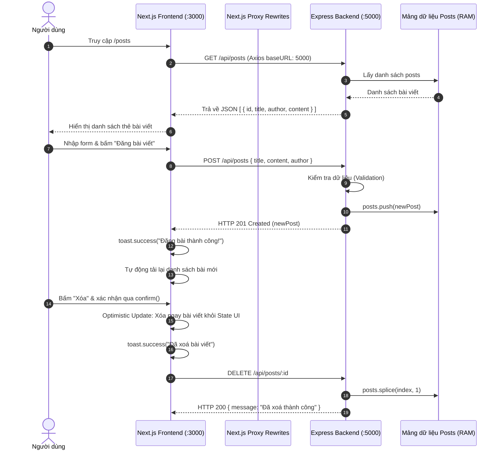

# BÀI THỰC HÀNH LAB 3: FULLSTACK INTEGRATION (NEXTJS + EXPRESS)

Dự án thực hành kết nối Frontend Next.js với Backend Express nhằm xây dựng hệ thống quản lý bài viết hoàn chỉnh với cơ chế xử lý CORS, giao tiếp RESTful API, quản lý trạng thái giao diện với Optimistic Update và giao diện hiện đại.

---

## 1. Thông Tin Cá Nhân

- **Họ và tên:** Nguyễn Thái Tuấn
- **Mã số sinh viên (MSSV):** N23DCPT054
- **Email:** [n23dcpt054@student.ptithcm.edu.vn](mailto:n23dcpt054@student.ptithcm.edu.vn) | [lucksnow1108@gmail.com](mailto:lucksnow1108@gmail.com)
- **Lớp / Đơn vị:** Học viện Công nghệ Bưu chính Viễn thông - Cơ sở TP. Hồ Chí Minh (PTIT HCM)
- **Bài thực hành:** Lab 3 - Nhóm 2: *Kết nối Frontend NextJS với Backend Express để quản lý bài viết / bình luận*
- **Repository:** [https://github.com/LuckSnow/N23DCPT054_NguyenThaiTuan_Web_Prac3a.git](https://github.com/LuckSnow/N23DCPT054_NguyenThaiTuan_Web_Prac3a.git)

---

## 2. Mô Tả Tổng Quan Dự Án

Dự án mô phỏng ứng dụng Fullstack Blog hiện đại, triển khai đầy đủ các yêu cầu theo tài liệu hướng dẫn Lab 3:

1. **Thiết lập môi trường & Xử lý CORS:**
   - Xây dựng Backend Express chạy tại cổng `5000`, cấu hình middleware `cors` chỉ định rõ origin cho phép từ Next.js (`http://localhost:3000`).
   - Cấu hình giải pháp thay thế Proxy rewrites trong `next.config.ts` để định tuyến các request `/api/:path*` từ Frontend sang Backend mà không gặp lỗi trình duyệt chặn cùng nguồn (Same-Origin Policy).

2. **Giao tiếp Dữ liệu & Quản lý API:**
   - Xây dựng các Endpoint chuẩn RESTful: `GET`, `POST`, `PUT`, `DELETE` cho tài nguyên bài viết (`/api/posts`).
   - Triển khai gọi dữ liệu bằng cả Native Fetch API và nâng cấp sang thư viện **Axios** với instance cấu hình tập trung (`frontend/lib/api.ts`).
   - Kiểm tra dữ liệu đầu vào (Validation) ở phía server (tiêu đề, nội dung, tác giả).

3. **Trải nghiệm Người dùng (UX) & Thông báo phản hồi:**
   - Tích hợp thư viện `react-hot-toast` với component `<Toaster position="top-right" />` trong Root Layout.
   - Hiển thị thông báo Toast trực quan khi: đăng bài thành công, xóa bài viết, cập nhật bài viết hoặc khi xảy ra sự cố kết nối máy chủ.

4. **Kỹ thuật Optimistic Update (Cập nhật lạc quan):**
   - Khi xóa bài viết: người dùng bấm xác nhận qua hộp thoại confirm, giao diện lập tức lọc bỏ bài viết khỏi state ngay lập tức giúp thao tác mượt mà không cần F5 tải lại trang.
   - Tự động Rollback: nếu server trả về mã lỗi hoặc gặp sự cố mạng, ứng dụng tự động gọi lại API để đồng bộ trạng thái chính xác.

5. **Phần Nâng Cao (Bonus):**
   - Bổ sung chức năng chỉnh sửa bài viết với API `PUT /api/posts/:id` ở Backend.
   - Cung cấp Modal cập nhật hiện đại ở Frontend với dữ liệu được điền sẵn, cho phép người dùng thay đổi tiêu đề, tác giả và nội dung nhanh chóng.

6. **Thiết kế Giao diện Hiện Đại (Modern UI):**
   - Ứng dụng Tailwind CSS với phong cách thiết kế giao diện phẳng kết hợp hiệu ứng đổ bóng mờ (soft shadows), bo tròn góc hiện đại (`rounded-2xl`).
   - Thẻ hiển thị bài viết trực quan kèm ảnh đại diện chữ cái (Avatar initials), thời gian đăng bài được format rõ ràng, huy hiệu trạng thái kết nối máy chủ `:5000`.

---

## 3. Sơ Đồ Cấu Trúc Của Dự Án

### 3.1. Cấu Trúc Thư Mục

```text
fullstack-blog/
├── .gitignore               # Tệp cấu hình bỏ qua thư mục/tệp nhạy cảm khi đẩy lên Git
├── README.md                # Tài liệu hướng dẫn và thông tin đồ án
├── Lab3_nhom2.pdf           # Tài liệu hướng dẫn thực hành Lab 3
│
├── backend/                 # Máy chủ RESTful API (Node.js & Express)
│   ├── server.js            # Khởi tạo server, cấu hình CORS, Router (GET, POST, PUT, DELETE)
│   ├── package.json         # Danh sách thư viện backend (express, cors, dotenv, nodemon)
│   └── package-lock.json
│
└── frontend/                # Ứng dụng giao diện người dùng (Next.js 16 App Router & Tailwind CSS)
    ├── app/
    │   ├── globals.css      # Cấu hình styles toàn cục và Tailwind v4
    │   ├── layout.tsx       # Root Layout tích hợp Toaster từ react-hot-toast
    │   ├── page.tsx         # Trang chủ tự động chuyển hướng sang /posts
    │   └── posts/
    │       └── page.tsx     # Trang giao diện chính: form tạo bài, danh sách, sửa (modal), xóa
    ├── lib/
    │   └── api.ts           # Cấu hình Axios instance tập trung kết nối Backend port 5000
    ├── next.config.ts       # Cấu hình Next.js (chứa rewrites proxy chuyển tiếp /api/*)
    ├── tsconfig.json        # Cấu hình TypeScript
    ├── package.json         # Danh sách thư viện frontend (next, react, axios, react-hot-toast...)
    └── package-lock.json
```

### 3.2. Sơ Đồ Luồng Hoạt Động (Architecture Flow)



---

## 4. Hướng Dẫn Cài Đặt và Khởi Chạy Code

### 4.1. Yêu Cầu Môi Trường
- **Node.js**: Phiên bản 18.x trở lên.
- **npm**: Trình quản lý gói đi kèm Node.js.
- **Git**: Đã cài đặt trên máy.

---

### 4.2. Clone Mã Nguồn Dự Án

```bash
git clone https://github.com/LuckSnow/N23DCPT054_NguyenThaiTuan_Web_Prac3a.git
cd N23DCPT054_NguyenThaiTuan_Web_Prac3a
```

---

### 4.3. Cài Đặt & Khởi Chạy Backend (Express Server)

1. Mở một cửa sổ Terminal (Terminal 1) và di chuyển vào thư mục `backend`:
   ```bash
   cd backend
   ```

2. Cài đặt các thư viện phụ thuộc:
   ```bash
   npm install
   ```

3. Khởi chạy máy chủ Backend:
   ```bash
   node server.js
   # Hoặc chạy ở chế độ dev nếu có nodemon:
   # npm run dev
   ```

4. **Kiểm tra hoạt động:**
   - Màn hình console xuất hiện thông báo: `Backend chạy tại port :5000`
   - Truy cập kiểm tra API trên trình duyệt: [http://localhost:5000/api/posts](http://localhost:5000/api/posts)

---

### 4.4. Cài Đặt & Khởi Chạy Frontend (Next.js)

1. Mở một cửa sổ Terminal mới (Terminal 2) và di chuyển vào thư mục `frontend`:
   ```bash
   cd frontend
   ```

2. Cài đặt các thư viện phụ thuộc:
   ```bash
   npm install
   ```

3. Khởi chạy máy chủ phát triển Next.js:
   ```bash
   npm run dev
   ```

4. **Kiểm tra hoạt động:**
   - Mở trình duyệt web và truy cập địa chỉ: [http://localhost:3000](http://localhost:3000) (hệ thống sẽ tự động điều hướng vào trang quản lý bài viết [http://localhost:3000/posts](http://localhost:3000/posts)).

---

## 5. Danh Sách Các RESTful API Đã Xây Dựng

| Phương thức | Đường dẫn Endpoint | Chức năng | Tham số / Dữ liệu yêu cầu | Trạng thái phản hồi |
| :--- | :--- | :--- | :--- | :--- |
| **GET** | `/api/posts` | Lấy danh sách toàn bộ bài viết | Không | `200 OK` |
| **POST** | `/api/posts` | Thêm bài viết mới | Body: `{ title, content, author }` | `201 Created` / `400 Bad Request` |
| **PUT** | `/api/posts/:id` | Cập nhật thông tin bài viết | Params: `id`, Body: `{ title, content, author }` | `200 OK` / `404 Not Found` |
| **DELETE** | `/api/posts/:id` | Xóa bài viết theo ID | Params: `id` | `200 OK` / `404 Not Found` |

---

## 6. Checklist Tự Kiểm Tra Trước Khi Hoàn Thành

- [x] Backend chạy ổn định tại port `5000`, cung cấp đầy đủ các route: `GET / POST / PUT / DELETE /api/posts`.
- [x] Frontend kết nối API thành công, cấu hình CORS hợp lệ, không phát sinh lỗi CORS trong Browser Console.
- [x] Form đăng bài hoạt động mượt mà, bài viết mới xuất hiện ngay lập tức trong danh sách.
- [x] Chức năng Xóa bài viết với cơ chế **Optimistic Update** hoạt động chuẩn xác (danh sách tự cập nhật ngay không cần F5).
- [x] Thông báo Toast trực quan hiển thị đầy đủ khi thêm bài, sửa bài, xóa bài và xử lý khi gặp lỗi.
- [x] Hoàn thiện phần nâng cao (Bonus): Chỉnh sửa bài viết với API `PUT` và giao diện Modal trực quan.
- [x] Toàn bộ mã nguồn sạch đẹp, không phát sinh lỗi đỏ trong Browser Console và Backend Terminal.