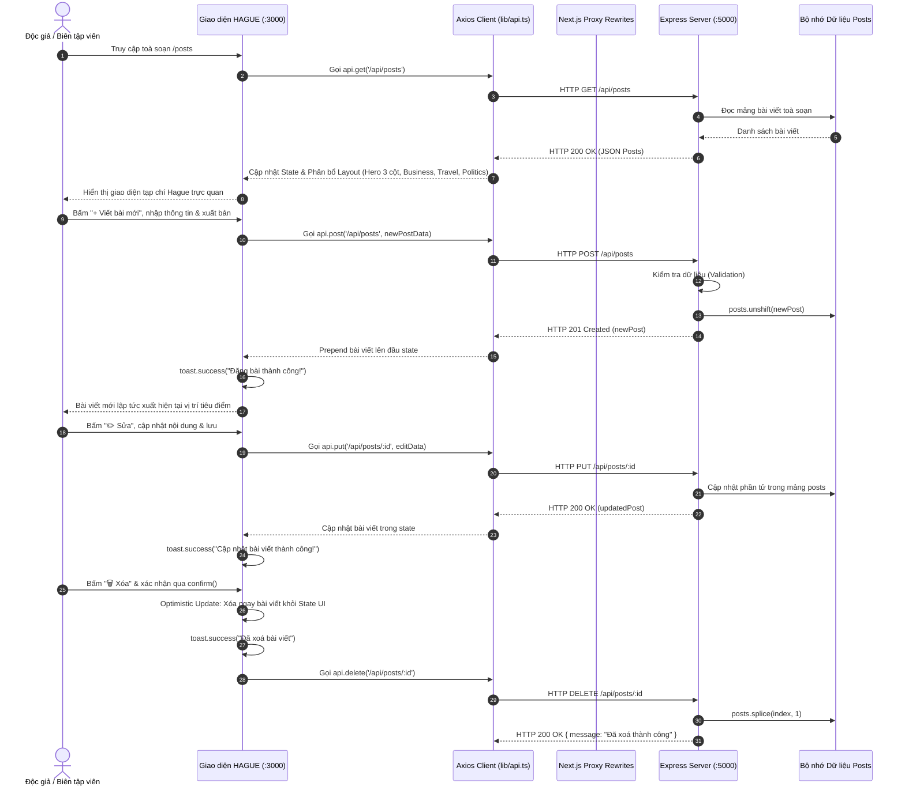

# BÀI THỰC HÀNH LAB 3: FULLSTACK INTEGRATION (NEXTJS + EXPRESS)

Dự án thực hành kết nối Frontend Next.js với Backend Express nhằm xây dựng hệ sinh thái quản lý bài viết hoàn chỉnh với cơ chế xử lý CORS, giao tiếp RESTful API, quản lý trạng thái giao diện với Optimistic Update và giao diện toà soạn tin tức hiện đại lấy cảm hứng từ phong cách tạp chí **Hague (Clean News Website Inspiration)**.

---

## 1. Thông Tin Cá Nhân

- **Họ và tên:** Nguyễn Thái Tuấn
- **Mã số sinh viên (MSSV):** N23DCPT054
- **Lớp:** D23CQPTUD01-N
- **Bài thực hành:** Lab 3 - Nhóm 2: *Kết nối Frontend NextJS với Backend Express để quản lý bài viết / bình luận*

---

## 2. Mô Tả Tổng Quan Dự Án

Dự án triển khai đầy đủ các yêu cầu kỹ thuật theo tài liệu hướng dẫn Lab 3 kết hợp tái thiết kế toàn bộ giao diện theo chuẩn toà soạn báo chí hiện đại **Hague**:

1. **Thiết lập môi trường & Xử lý CORS:**
   - Xây dựng Backend Express chạy tại cổng `5000`, cấu hình middleware `cors` chỉ định rõ origin cho phép từ Next.js (`http://localhost:3000`).
   - Cấu hình giải pháp thay thế Proxy rewrites trong `next.config.ts` để định tuyến các request `/api/:path*` từ Frontend sang Backend mà không gặp lỗi trình duyệt chặn cùng nguồn (Same-Origin Policy).

2. **Giao tiếp Dữ liệu & Quản lý API RESTful:**
   - Xây dựng các Endpoint chuẩn RESTful: `GET`, `POST`, `PUT`, `DELETE` cho tài nguyên bài viết (`/api/posts`).
   - Triển khai gọi dữ liệu bằng thư viện **Axios** với instance cấu hình tập trung (`frontend/lib/api.ts`).
   - Kiểm tra dữ liệu đầu vào (Validation) ở phía server (tiêu đề, nội dung, tác giả, chuyên mục, ảnh minh hoạ).

3. **Trải nghiệm Người dùng (UX) & Thông báo phản hồi:**
   - Tích hợp thư viện `react-hot-toast` với component `<Toaster position="top-right" />` trong Root Layout.
   - Hiển thị thông báo Toast trực quan khi: đăng bài thành công, xóa bài viết, cập nhật bài viết hoặc khi xảy ra sự cố kết nối máy chủ.

4. **Kỹ thuật Optimistic Update (Cập nhật lạc quan):**
   - Khi xóa bài viết: người dùng bấm xác nhận qua hộp thoại confirm, giao diện lập tức lọc bỏ bài viết khỏi state ngay lập tức giúp thao tác mượt mà không cần F5 tải lại trang.
   - Tự động Rollback: nếu server trả về mã lỗi hoặc gặp sự cố mạng, ứng dụng tự động gọi lại API để đồng bộ trạng thái chính xác.

5. **Thiết kế Giao diện Toà Soạn Báo Hague (Editorial Inspiration):**
   - **Masthead & Top Bar:** Logo toà soạn **HAGUE** trang nhã ở vị trí trung tâm, thanh điều hướng chuyên mục đa tầng (`OPINION`, `BUSINESS`, `POLITICS`, `TRAVEL`, `BOOKS`, `LIFESTYLE`), nút bấm nổi bật `+ Viết bài mới`.
   - **Hero Featured Section (3 cột đặc trưng):** Cột trái gồm 2 bài viết xếp tầng (Stacked cards), Cột giữa là bài viết tiêu điểm lớn nhất (Large Centerpiece), Cột phải là thanh tin mới nhất (LATEST Sidebar với ảnh thumbnail).
   - **Lưới chuyên mục 4 cột (4-Column Grid):** Phân chia rõ rệt các chuyên mục `BUSINESS` và `TRAVEL` với thẻ bài viết tỉ lệ ảnh vàng, tag thể loại màu xanh dương nổi bật và trích dẫn ngắn.
   - **Spotlight 2 phân vùng (POLITICS Section):** Bố cục bài tiêu điểm góc nhìn lớn bên trái kết hợp lưới 2x2 các bài báo ngắn bên phải.

6. **Các tính năng sáng tạo mở rộng:**
   - **Modal Soạn thảo bài viết mới:** Cung cấp bộ chọn ảnh toà soạn Hague nhanh chóng (Preset Image Gallery), nhập chuyên mục, tác giả và nội dung.
   - **Modal Chỉnh sửa bài viết (PUT - Nâng cao 1):** Cho phép sửa nhanh tiêu đề, tác giả, chuyên mục và nội dung bài viết.
   - **Modal Đọc bài viết (Reader Mode):** Trải nghiệm đọc báo không xao nhãng với kiểu chữ bài báo trang nhã, ảnh toàn cảnh và các nút thao tác nhanh.
   - **Thanh tìm kiếm tức thì (Live Search):** Lọc bài viết nhanh theo từ khoá tiêu đề, tác giả và nội dung.

---

## 3. Sơ Đồ Cấu Trúc Của Dự Án

### 3.1. Cấu Trúc Thư Mục

```text
fullstack-blog/
├── .gitignore                                     # Tệp cấu hình bỏ qua thư mục/tệp nhạy cảm khi đẩy lên Git
├── README.md                                      # Tài liệu hướng dẫn và thông tin đồ án
├── Lab3_nhom2.pdf                                 # Tài liệu hướng dẫn thực hành Lab 3
├── Hague _ Clean News Website Inspiration.jpg    # Ảnh mẫu thiết kế giao diện toà soạn Hague
│
├── backend/                                       # Máy chủ RESTful API (Node.js & Express)
│   ├── server.js                                  # Khởi tạo Express, cấu hình CORS, CRUD bài viết (/api/posts)
│   ├── package.json                               # Danh sách thư viện backend (express, cors, dotenv, nodemon)
│   └── package-lock.json
│
└── frontend/                                      # Ứng dụng giao diện người dùng (Next.js 16 & Tailwind CSS)
    ├── app/
    │   ├── globals.css                            # Cấu hình styles toàn cục, Tailwind v4 và Google Fonts toà soạn
    │   ├── layout.tsx                             # Root Layout tích hợp Toaster từ react-hot-toast
    │   ├── page.tsx                               # Trang chủ tự động chuyển hướng sang /posts
    │   └── posts/
    │       └── page.tsx                           # Giao diện chính toà soạn HAGUE (Hero 3 cột, Grid, Modals CRUD)
    ├── lib/
    │   └── api.ts                                 # Cấu hình Axios instance tập trung kết nối Backend port 5000
    ├── public/                                    # Tài nguyên tĩnh và SVG icons
    ├── next.config.ts                             # Cấu hình Next.js (chứa rewrites proxy chuyển tiếp /api/*)
    ├── tsconfig.json                              # Cấu hình TypeScript
    ├── package.json                               # Danh sách thư viện frontend (next, react, axios, react-hot-toast)
    └── package-lock.json
```

### 3.2. Sơ Đồ Luồng Hoạt Động & Tương Tác Dữ Liệu (Architecture Sequence)



---

## 4. Hướng Dẫn Cài Đặt và Khởi Chạy Code

### 4.1. Yêu Cầu Môi Trường
- **Node.js**: Phiên bản 18.x trở lên.
- **npm**: Trình quản lý gói đi kèm Node.js.
- **Git**: Đã cài đặt trên máy tính.

---

### 4.2. Clone Mã Nguồn Dự Án

```bash
git clone https://github.com/LuckSnow/N23DCPT054_NguyenThaiTuan_Web_Prac3a.git
cd N23DCPT054_NguyenThaiTuan_Web_Prac3a
```

---

### 4.3. Cài Đặt & Khởi Chạy Backend (Express Server)

1. Mở một cửa sổ Terminal (Terminal 1) và di chuyển vào thư mục `backend`:
   ```bash
   cd backend
   ```

2. Cài đặt các thư viện phụ thuộc:
   ```bash
   npm install
   ```

3. Khởi chạy máy chủ Backend:
   ```bash
   node server.js
   # Hoặc chạy chế độ nodemon nếu có:
   # npm run dev
   ```

4. **Kiểm tra hoạt động:**
   - Màn hình console xuất hiện thông báo: `Backend chạy tại port :5000`
   - Truy cập kiểm tra API trên trình duyệt: [http://localhost:5000/api/posts](http://localhost:5000/api/posts)

---

### 4.4. Cài Đặt & Khởi Chạy Frontend (Next.js)

1. Mở một cửa sổ Terminal mới (Terminal 2) và di chuyển vào thư mục `frontend`:
   ```bash
   cd frontend
   ```

2. Cài đặt các thư viện phụ thuộc:
   ```bash
   npm install
   ```

3. Khởi chạy máy chủ phát triển Next.js:
   ```bash
   npm run dev
   ```

4. **Kiểm tra hoạt động:**
   - Mở trình duyệt web và truy cập địa chỉ: [http://localhost:3000](http://localhost:3000) (hệ thống sẽ tự động điều hướng vào giao diện toà soạn [http://localhost:3000/posts](http://localhost:3000/posts)).

---

## 5. Danh Sách Các RESTful API Đã Xây Dựng

| Phương thức | Đường dẫn Endpoint | Chức năng | Tham số / Dữ liệu yêu cầu | Trạng thái phản hồi |
| :--- | :--- | :--- | :--- | :--- |
| **GET** | `/api/posts` | Lấy danh sách toàn bộ bài viết toà soạn | Không | `200 OK` |
| **POST** | `/api/posts` | Thêm bài viết mới (kèm ảnh và chuyên mục) | Body: `{ title, content, author, category, image }` | `201 Created` / `400 Bad Request` |
| **PUT** | `/api/posts/:id` | Cập nhật thông tin bài viết | Params: `id`, Body: `{ title, content, author, category, image }` | `200 OK` / `404 Not Found` |
| **DELETE** | `/api/posts/:id` | Xóa bài viết theo ID | Params: `id` | `200 OK` / `404 Not Found` |
